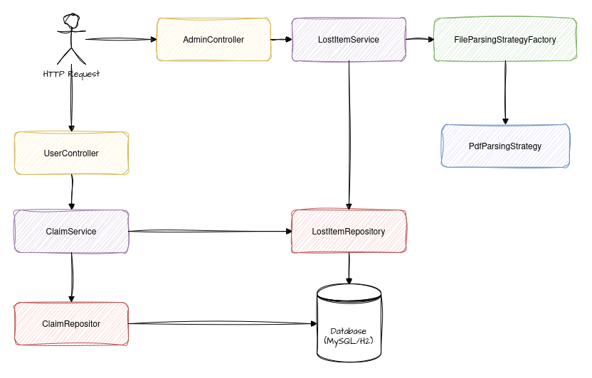

# Lost & Found Service

A comprehensive Lost & Found management system built with Spring Boot 3, featuring file upload capabilities, basic authentication, and role-based access control.

## Architecture



## Features

- **Basic Authentication & Authorization** - Currently using basic auth with role-based access control (USER/ADMIN)
- **PDF File Processing** - Upload and parse PDF files containing lost item records
- **Advanced Search** - Search lost items by name and location
- **Claim Management** - Users can claim items with concurrency control
- **Admin Dashboard** - Administrative functions for managing claims and items
- **Retry Mechanism** - Handles optimistic locking failures automatically
- **API Documentation** - Interactive Swagger UI documentation

## Technology Stack

- **Java 21** + **Spring Boot 3.5.0**
- **Spring Security** - Basic authentication
- **Spring Data JPA** + **MySQL/H2**
- **Apache PDFBox** - PDF processing
- **Springdoc OpenAPI** - API documentation
- **Maven** - Dependency management

## Quick Start

### Prerequisites
- Java 21+
- Maven 3.6+
- MySQL 8.0+ (optional, H2 included for testing)

### Run the Application
```bash
git clone <repository-url>
cd lostfound
mvn clean install
mvn spring-boot:run
```

The application starts on `http://localhost:8080`

### Configuration

Environment variables:
```bash
# Database (for MySQL)
export DB_USERNAME=your_db_username
export DB_PASSWORD=your_db_password

# Admin credentials
export ADMIN_USERNAME=admin
export ADMIN_PASSWORD=admin123
```

## API Documentation

- **Swagger UI**: http://localhost:8080/swagger-ui.html
- **OpenAPI JSON**: http://localhost:8080/api-docs

## Key Endpoints

### User Endpoints
- `GET /api/user/items` - Browse available items
- `GET /api/user/items/search` - Search items
- `POST /api/user/claims` - Create a claim
- `GET /api/user/claims` - Get user's claims

### Admin Endpoints
- `POST /api/admin/upload` - Upload PDF file with lost items
- `GET /api/admin/claims` - Get all claims
- `PUT /api/admin/claims/{id}/status` - Update claim status
- `GET /api/admin/stats` - Get system statistics

## PDF Format Support

The system accepts PDF files with lost items in these formats:

**Structured Format:**
```
Item Name: Laptop
Quantity: 1
Place: Library
```

**CSV Format:**
```
Laptop, 1, Library
USB Drive, 3, Computer Lab
```

## Default Credentials

- **Username**: admin
- **Password**: admin123
- **Role**: ADMIN

## Testing

```bash
mvn test
```

## Health Checks

- **Health**: http://localhost:8080/actuator/health
- **Metrics**: http://localhost:8080/actuator/metrics

## Future Improvements & Scalability

### Security Enhancements
- **Key Vault Integration**: Use Azure Key Vault or AWS Secrets Manager for secure password management
- **Auth & Rate Limiting**: Implement API key authentication for public API exposure
- **OAuth2/OIDC Authentication**: Migrate from basic auth to OAuth2/OpenID Connect for production standards - more secure and industry-standard approach
- **JWT Authentication**: Implement stateless JWT tokens for better scalability

### Performance & Scalability
- **Batch Processing**: Implement batch processing for bulk data operations in production environments
- **Database Optimization**: Add database indexing and query optimization for large datasets
- **Caching Layer**: Integrate Redis for frequently accessed data

### Observability & Monitoring
- **Metrics Export**: Export custom metrics using Micrometer to monitoring systems (Prometheus, DataDog)
- **Distributed Tracing**: Implement OpenTelemetry for request tracing across services
- **Structured Logging**: Enhanced logging with correlation IDs and structured formats

### Additional Features
- **Real-time Notifications**: WebSocket-based notifications for claim updates
- **Mobile App**: React Native mobile application
- **OAuth2 Integration**: Social login capabilities
- **Microservices Architecture**: Split into domain-specific services for better scalability 